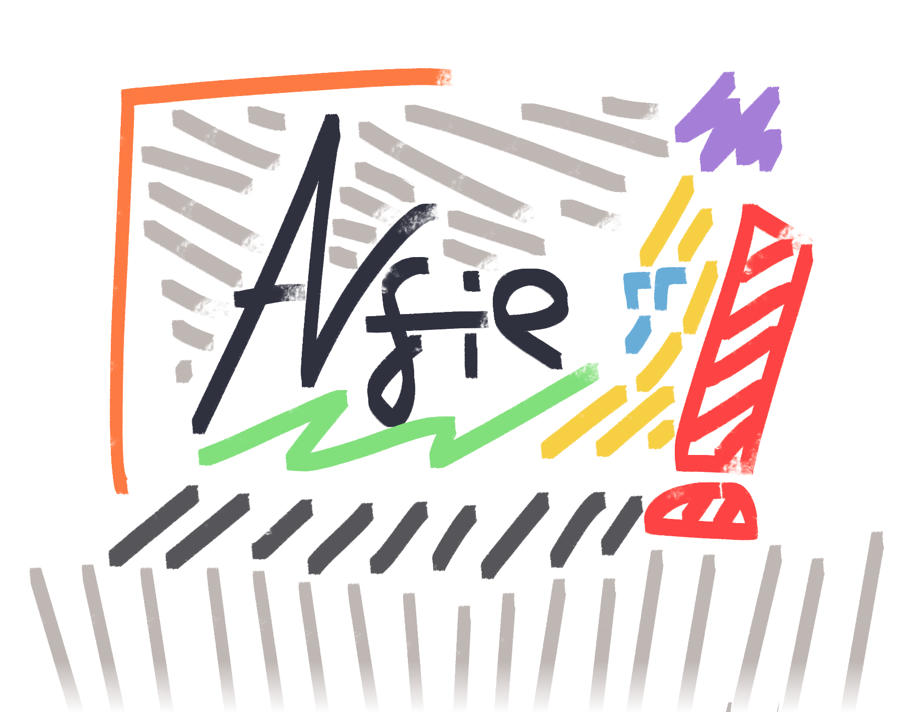
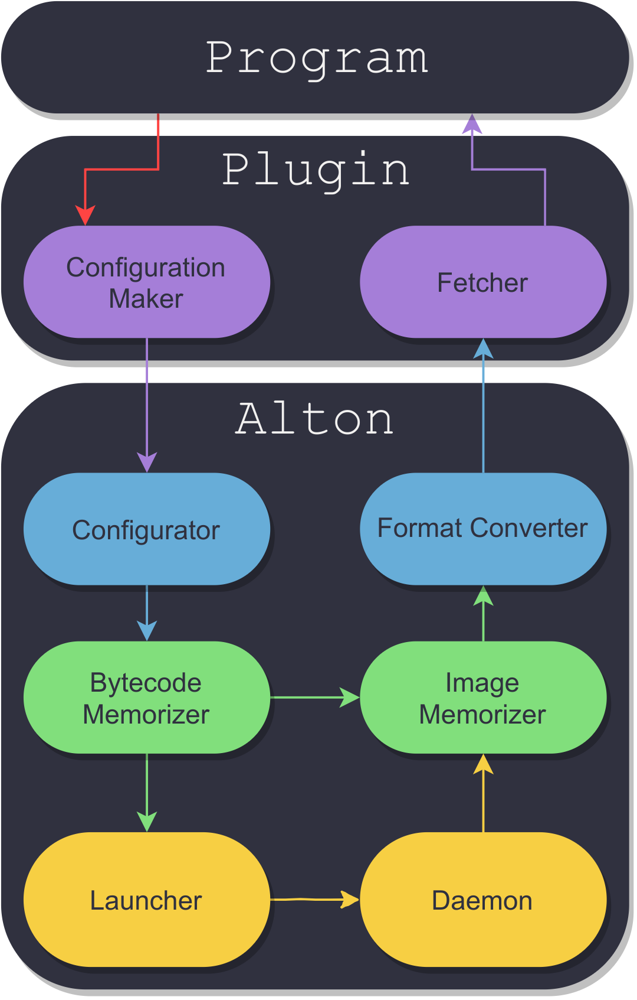

Alfie is **A Language For Image procEssing**; Whose purpose is to replace system-dependent addons for applications like [Photoshop](https://www.photoshop.com/), [GIMP](https://www.gimp.org/), and [Substance Designer](https://www.substance3d.com/).

Alton is the **Alfie Language's Typical implementatiON**; Designed to set a refrence point for other implementations, and provide standard Alfie usage for it's users.

## Compiling

Compiling Alton is easy! [See BUILDING.md for an easy howto](BUILDING.md).

## How it works

Alfie's standards describe a simple structure for the image processing workflow. The diagram is as follows:

Of course, the structure of this diagram is pretty basic, and it doesn't cover every design aspect of Alton that a developer should note while designing an implementation.
One may ask about the reasoning behind not putting all of the components in one single plugin; The answer would note the fact that a lightweight plugin will always run faster than an all-in-one version.

## Versioning

Alton supports a [SEMVER](https://semver.org/)-compatible versioning protocol. - See the [VERSIONING.md](VERSIONING.md) file for the definition.

## License

This project is licensed under the **Boost Software License ( BSL )**. - See the [LICENSE](LICENSE) or the [COPYING](COPYING) file for more details.

## Developed with

A bunch of cool and *free* software on the internet! - See the [CREDIT.md](CREDIT.md) file for more deets.

## Badges

